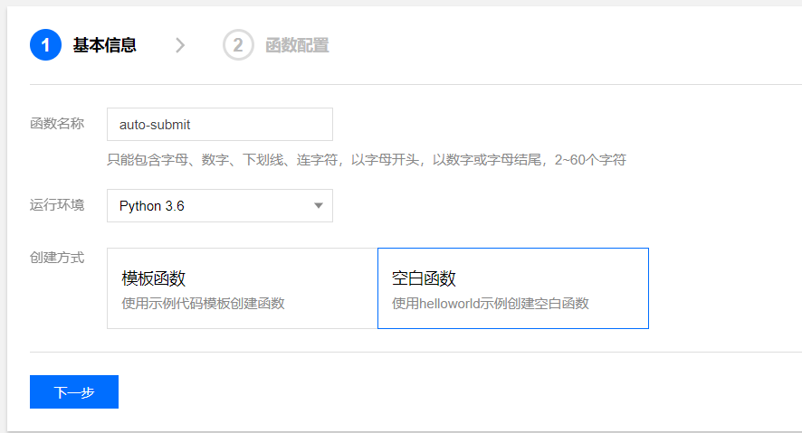

# 今日校园自动签到
参考了 https://github.com/ZimoLoveShuang/auto-submit

适配了长春理工大学计算机科学技术学院18级同学的签到。

有任何问题可以联系我： minilct@qq.com

# 食用姿势

## clone 或者 下载 此仓库到本地
> git clone https://github.com/miniLCT/campushoy-auto-clock-in.git

## 配置
编辑cofig.yml,编辑以下内容

> 1.#username 学号或者工号
填写今日校园学号
      
>2.#password 密码
填写今日校园的密码
    
>3.#address 地址，定位信息
address:  以前你签到时候的地址信息，比如 中国四川省成都市金牛区一环路北xx段-xx号-附xx号

>4.#school 学校全称
school: 长春理工大学
      
>5.#KEY Qmsg的KEY
key:  #提醒用，可以没有 

>6.#lon 当前位置经度，可以访问http://zuobiao.ay800.com/s/27/index.php获取
lon: #写经度

>7.#lat 纬度
lat:  #写维度

>8.实际上 填好表达必填项便可适配其他没被禁止的高校了？
 defaults:
    #表单默认选项配置，按顺序，注意，只有标必填项的才处理
    - default:
        #表单项类型，对应今日校园接口返回的fieldType字段，1代表文本，2代表单选，3代表多选，4代表图片
        type: 2
        #表单项标题
        title: 
        #表单项默认值
        value: 否

## 上传到腾讯云云函数
1. 进入[腾讯云函数](https://console.cloud.tencent.com/scf/index?rid=1)，注册认证后，进入控制台，点击左边的层，然后点新建，名称随意，然后点击上传zip，选择仓库种的`dependency.zip`上传，然后选择运行环境`python3.6`，然后点击确定，等待依赖包上传。


2. 点左边的函数服务，新建云函数，名称随意，运行环境选择`python3.6`，创建方式选择空白函数，然后点击下一步


3. 提交方法选择在线编辑，把本地修改好的`index.py`直接全文复制粘贴到云函数的`index.py`，然后点击文件->新建，文件名命名为`config.yml`，然后把本地配置好的`config.yml`文件中的内容直接全文复制粘贴到云函数的`config.yml`文件，点击下面的高级设置，设置超时时间为`60秒`，添加层为刚刚新建的函数依赖层，然后点击完成。（如果新版很慢打不开用旧版编辑上传也行）


4. 进入新建好的云函数，左边点击触发管理，点击创建触发器，名称随意，触发周期选择自定义，然后配置cron表达式，由于我校是0点4分开启签到，所以编写如下cron表达式表示每天0点10分开始签到。
    ```shell script
   0 10 0 * * * *
    ```

5. 然后就可以测试云函数了，绿色代表云函数执行成功，红色代表云函数执行失败（失败的原因大部分是由于依赖造成的）。返回结果是`success.`，代表自动提交成功，如遇到问题，仔细查看日志。

6. 也可配合Windows计划任务或者使用linux定时任务，将脚本挂在自己的云服务器上。

7. **如此就不用担心忘记签到而被艾特了，就可以放心的删除今日校园这么屑的软件啦**

## todolist： Qmsg的提醒
今天设置了，不知道明天能不能收到Qmsg提醒。
只要在  `#KEY Qmsg的KEY` 一栏填上[Qmsg酱](https://qmsg.zendee.cn/) 的key就行了把？？（大概是这样，还需要实践检验）
Qmsg的api:https://qmsg.zendee.cn/api.html